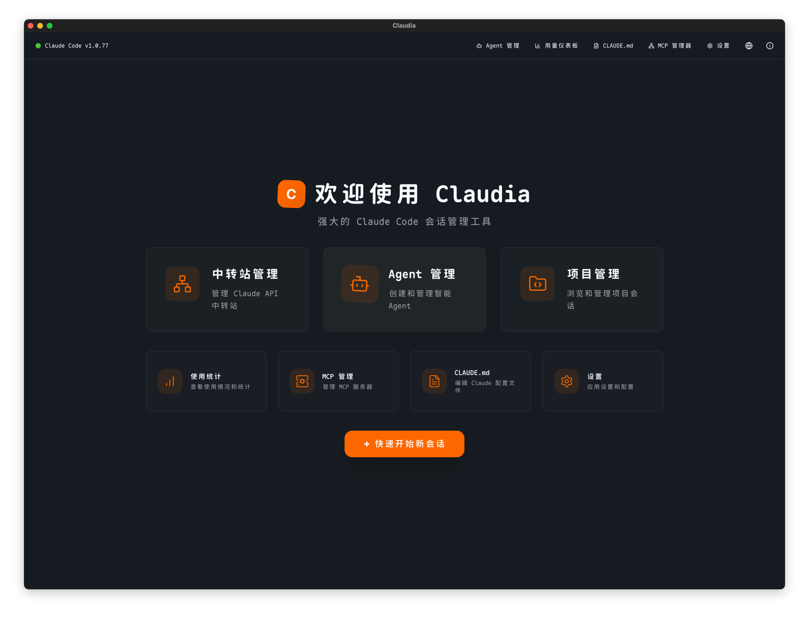
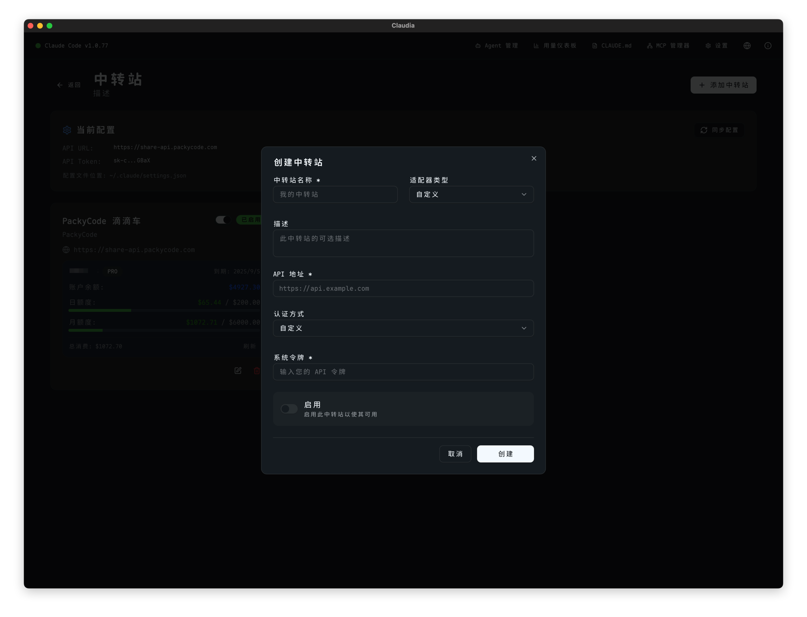
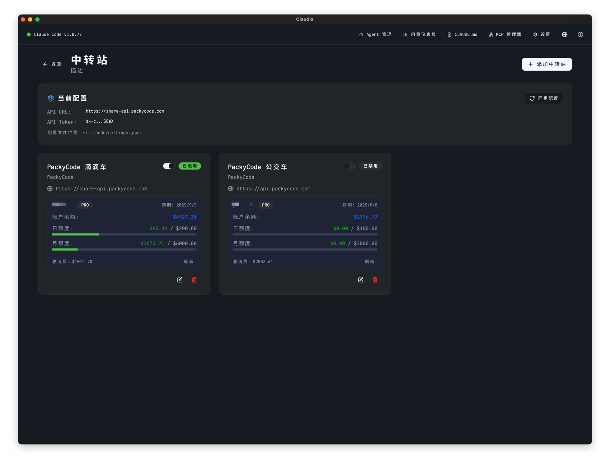
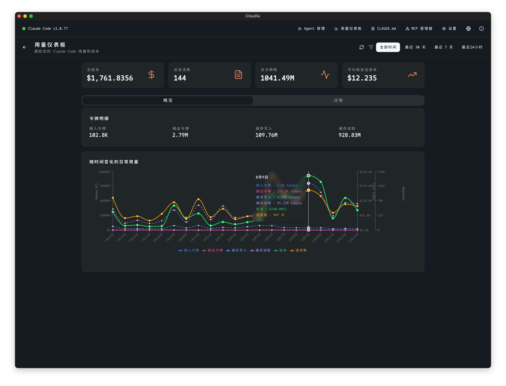
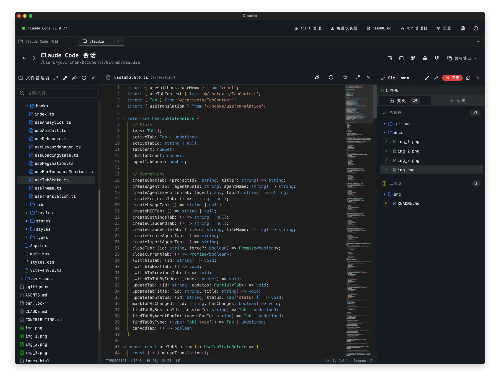
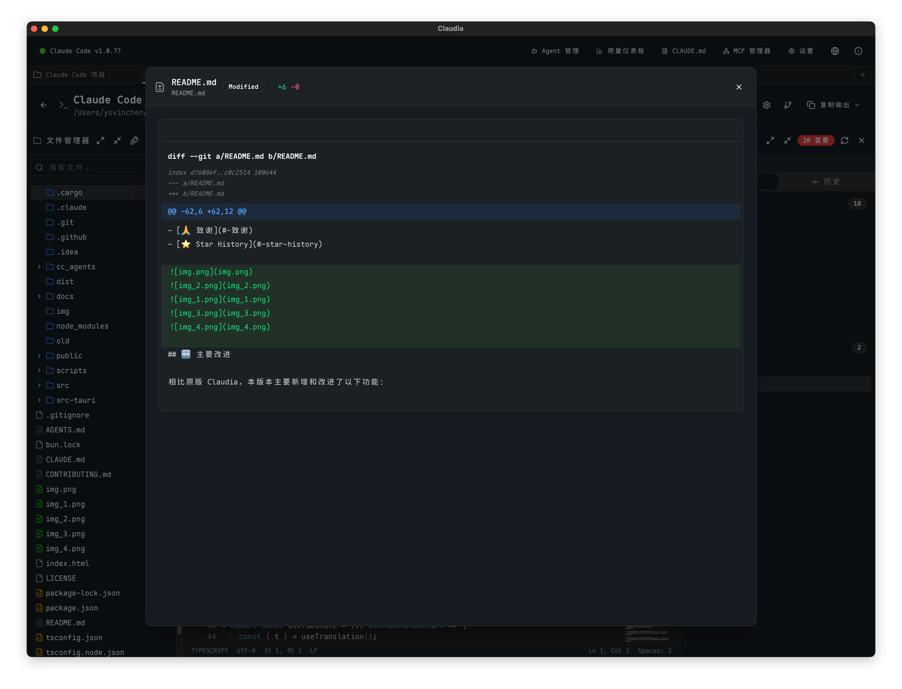
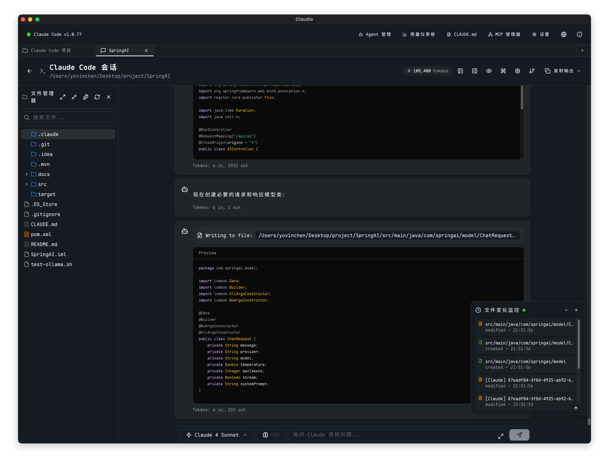

# Claudia - Claude Code 桌面客户端

<div align="center">
  

  <a href="https://claudiacode.com"><h1>Claudia</h1></a>

  <p><strong>强大的 Claude Code GUI 应用</strong></p>
  <p><em>代理管理 · 会话控制 · 使用分析</em></p>

  <p>
    <a href="#-功能特性"></a>
    <a href="#-安装使用"></a>
    <a href="#️-开发"></a>
  </p>
</div>

## 📖 项目概述

基于 Tauri 2 的 Claude Code 图形界面，提供项目管理、AI代理、使用分析等功能。

> 基于 [Asterisk Claudia](https://github.com/getAsterisk/claudia) 改进，参考 [Claude Suite](https://github.com/xinhai-ai/claude-suite) 和 [PackyCode Cost](https://github.com/94mashiro/packycode-cost)。

## 📸 应用截图









## ✨ 功能特性

### 🗂️ 项目会话管理
- 自动检测 Claude 项目，快速恢复会话
- 版本控制检查点，支持分支回滚  
- 实时同步项目状态和历史

### 🤖 AI 代理系统
- 创建自定义代理，后台独立执行
- 详细运行日志，精细权限控制
- 非阻塞操作，高效任务管理

### 🔗 API 中转站
- 支持 PackyCode、Custom 等多平台
- 实时额度查询，一键切换配置
- 自动同步到 Claude 设置

### 📊 使用分析
- 实时成本跟踪，Token 详细统计
- 可视化图表，数据导出分析
- 按模型、项目、时间段分类

### 🎨 编辑增强
- Monaco 编辑器，40+ 语言高亮
- 智能补全，实时诊断错误
- 多光标编辑，代码自动格式化

### 📁 文件监听
- 跨平台实时监听，外部修改同步
- 防抖机制，轮询降级方案
- 基于 Rust notify 高性能

## 🚀 安装使用

### 前提条件
- [Claude Code CLI](https://claude.ai/code) 已安装
- `claude` 命令在 PATH 中可用

### 快速开始
1. 启动 Claudia
2. 选择 CC 代理 或 CC 项目模式
3. 创建代理或管理会话

### 中转站配置
菜单 → 中转站管理 → 创建 → 输入 Token → 启用

## 🔨 从源码构建

### 系统要求
- Windows 10+ / macOS 11+ / Linux
- 4GB+ RAM，Rust 1.70+，Bun

### 平台依赖
**Linux**
```bash
sudo apt install -y libwebkit2gtk-4.1-dev libgtk-3-dev libayatana-appindicator3-dev \
  librsvg2-dev patchelf build-essential libssl-dev
```

**macOS**
```bash
xcode-select --install
```

**Windows**
- Microsoft C++ Build Tools + WebView2

### 构建步骤
```bash
git clone https://github.com/yovinchen/claudia.git
cd claudia
bun install
bun run tauri dev    # 开发模式
bun run tauri build  # 生产构建
```

## 🛠️ 开发

### 技术栈
- **前端**: React 18 + TypeScript + Vite 6 + Tailwind CSS v4
- **后端**: Rust + Tauri 2 + SQLite
- **编辑器**: Monaco Editor

### 开发命令
```bash
bun run tauri dev      # 启动开发服务器
bunx tsc --noEmit      # 类型检查
cd src-tauri && cargo test.md  # Rust 测试
bun run check          # 完整检查
```

### 项目结构
```
claudia/
├── src/             # React 前端
├── src-tauri/       # Rust 后端
└── docs/           # 文档
```

## 🔒 安全特性

- 进程隔离，精细权限控制
- 本地存储，无数据收集
- 开源透明，代码可审计

## 🤝 贡献

欢迎贡献！查看 [贡献指南](CONTRIBUTING.md)。

**贡献领域**: Bug修复 · 新功能 · 文档 · UI/UX · 测试 · 国际化

## 📄 许可证

AGPL 许可证 - 详见 [LICENSE](LICENSE)

## 🙏 致谢

- [Tauri](https://tauri.app/) - 安全桌面应用框架
- [Asterisk Claudia](https://github.com/getAsterisk/claudia) - 原始项目
- [Claude](https://claude.ai) by Anthropic

---

<div align="center">
  <p><strong>由 <a href="https://github.com/yovinchen">YovinChen</a> 改进</strong></p>
  <p><a href="https://github.com/yovinchen/claudia/issues">报告 Bug</a> · <a href="https://github.com/yovinchen/claudia/issues">请求功能</a></p>
</div>

## ⭐ Star History

[](https://star-history.com/#yovinchen/claudia&Date)
