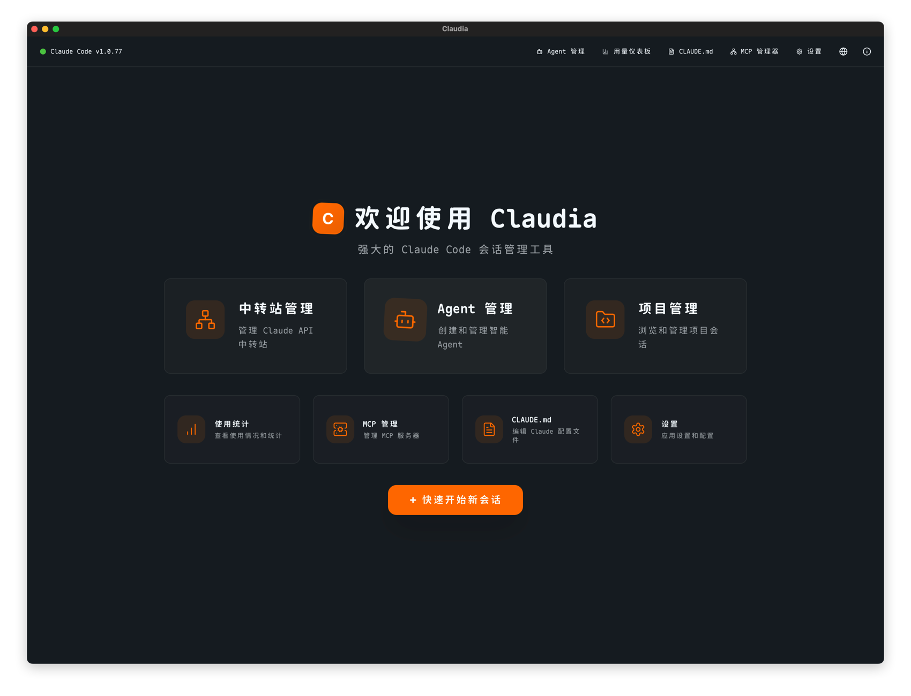
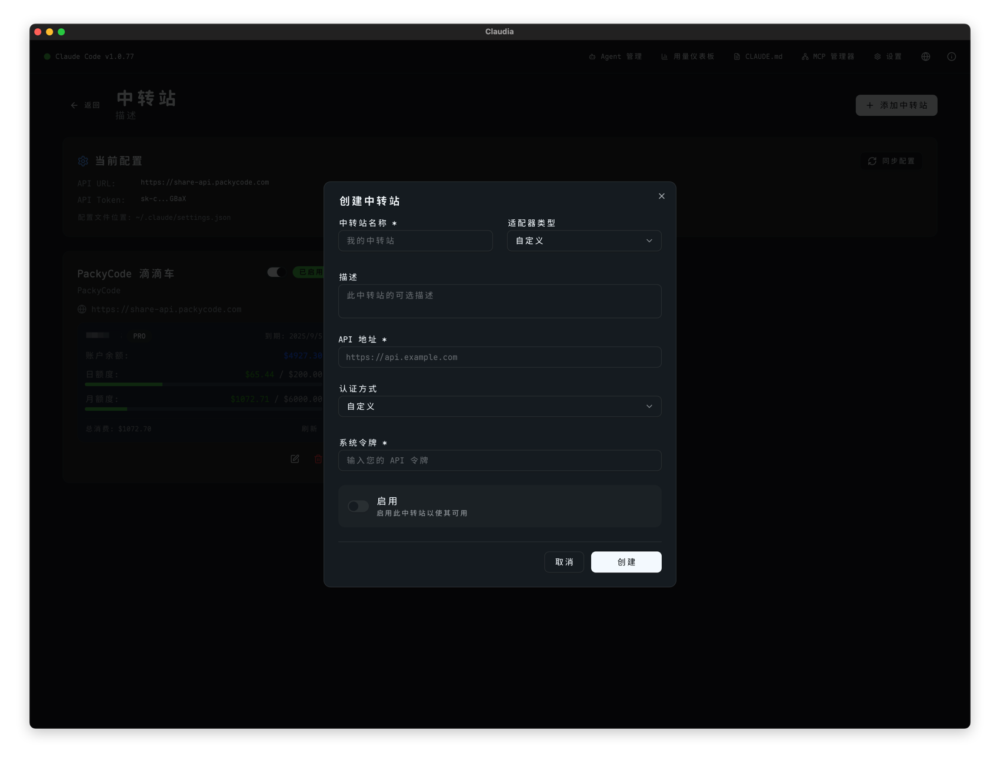
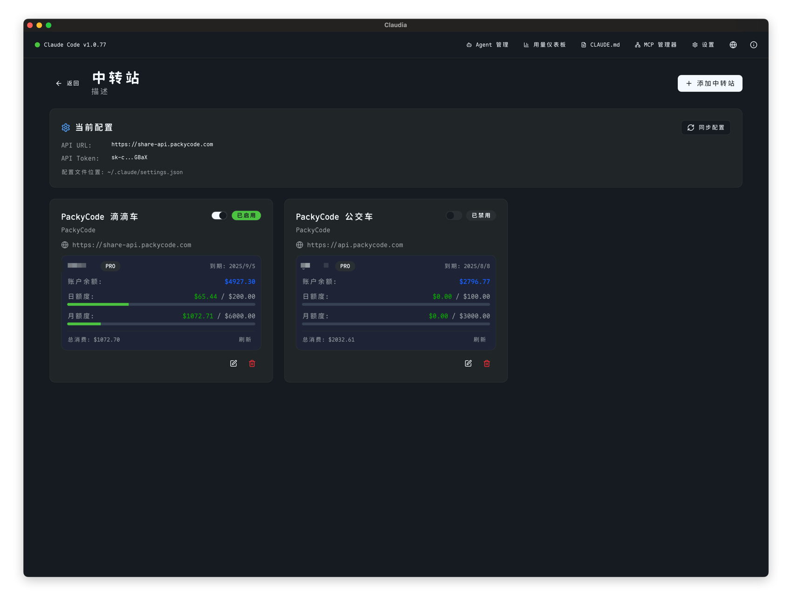
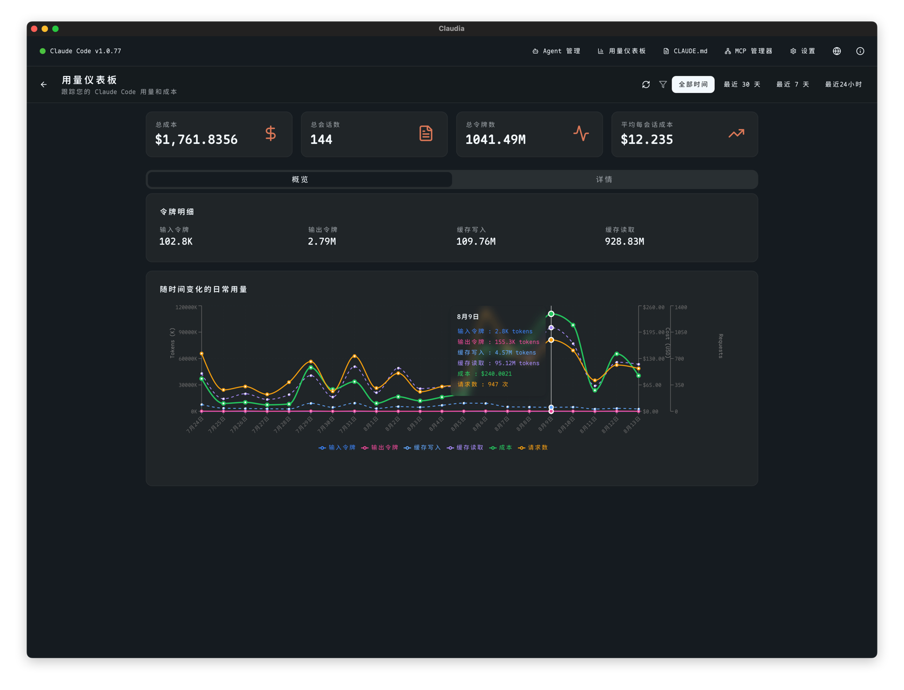
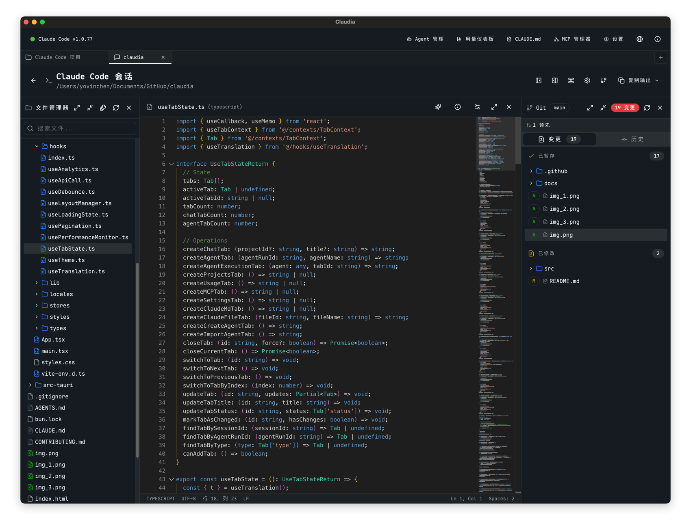
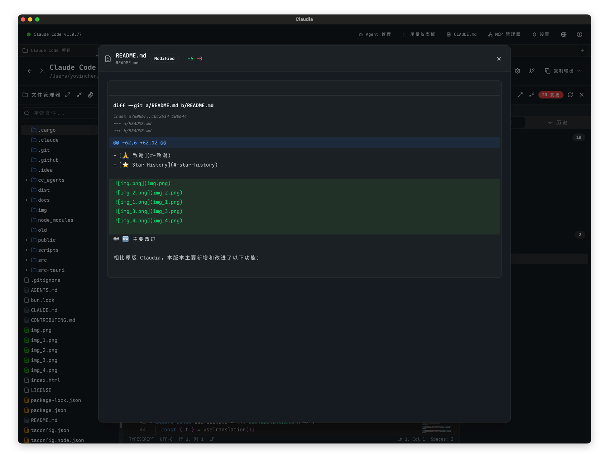
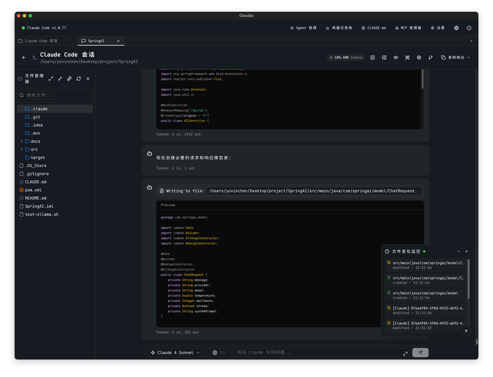

# Claudia - Claude Code 桌面客户端

<div align="center">
  

  <a href="https://claudiacode.com"><h1>Claudia</h1></a>

  <p><strong>强大的 Claude Code GUI 应用</strong></p>
  <p><em>代理管理 · 会话控制 · 使用分析</em></p>

  <p>
    <a href="#-功能特性"></a>
    <a href="#-安装使用"></a>
    <a href="#️-开发"></a>
  </p>
</div>

## 📖 项目概述

基于 Tauri 2 的 Claude Code 图形界面，集成项目管理、AI代理、使用分析、MCP服务器、API中转站等强大功能。

> 基于 [opcode（原 Asterisk Claudia）](https://github.com/winfunc/opcode) 改进，参考 [Claude Suite](https://github.com/xinhai-ai/claude-suite) 和 [PackyCode Cost](https://github.com/94mashiro/packycode-cost)。

## 📸 应用截图









## ✨ 功能特性

### 🗂️ 项目会话管理
- 自动检测 Claude 项目，快速恢复会话
- 版本控制检查点，支持分支回滚  
- 实时同步项目状态和历史
- Git Panel 集成，查看文件变更 diff

### 🤖 AI 代理系统
- 创建自定义代理，后台独立执行
- 详细运行日志，精细权限控制
- 非阻塞操作，高效任务管理
- 支持多代理并发运行

### 🔗 API 中转站
- 支持 PackyCode（公交车/滴滴车）、DeepSeek、GLM、Qwen、Kimi 等平台
- 实时额度查询，公交车/滴滴车服务切换
- Token 脱敏显示，安全配置管理
- 自动同步到 Claude 设置，一键刷新 DNS

### 📊 使用分析
- 实时成本跟踪，Token 详细统计
- 可视化图表，数据导出分析
- 按模型、项目、时间段分类
- SQLite 缓存优化，毫秒级查询响应

### 🎨 编辑增强
- Monaco 编辑器，40+ 语言高亮
- 智能补全，实时诊断错误
- 多光标编辑，代码自动格式化
- 主题快速切换，深色/浅色模式

### 📁 文件监听
- 跨平台实时监听，外部修改同步
- 防抖机制，轮询降级方案
- 基于 Rust notify 高性能
- 支持大型项目文件变更追踪

### 🔌 MCP 服务器
- Model Context Protocol 支持
- 服务器配置管理，一键启用/禁用
- 支持多服务器并发管理
- 与 Claude 设置深度集成

### 🖥️ 终端集成
- 内置终端支持，执行命令行操作
- 会话数据持久化，历史记录保留
- 支持多终端标签页
- 自动识别系统 Shell

### 🎯 Claude Code Review (CCR)
- 集成 Claude Code Review 功能
- 一键启动/停止 CCR 服务
- 自动检测安装状态
- 支持打开 CCR UI 界面

## 🚀 安装使用

### 前提条件
- [Claude Code CLI](https://claude.ai/code) 已安装
- `claude` 命令在 PATH 中可用

### 快速开始
1. 下载并安装 Claudia
2. 启动应用，选择 CC 代理或 CC 项目模式
3. 创建代理或管理会话
4. 配置中转站享受更好的服务体验

### 中转站配置
1. 菜单 → 中转站管理
2. 点击"创建中转站"
3. 选择服务类型（PackyCode 公交车/滴滴车等）
4. 输入 API Token
5. 点击启用按钮

### 性能优化说明
- **用量分析**: 首次扫描后自动缓存，后续查询毫秒级响应
- **文件监听**: 采用防抖机制，避免频繁触发
- **大项目支持**: 优化了内存使用，支持大型代码库
- **实时响应**: 所有操作异步执行，界面始终流畅

## 🔨 从源码构建

### 系统要求
- Windows 10+ / macOS 11+ / Linux
- 4GB+ RAM，Rust 1.70+，Bun

### 平台依赖
**Linux**
```bash
sudo apt install -y libwebkit2gtk-4.1-dev libgtk-3-dev libayatana-appindicator3-dev \
  librsvg2-dev patchelf build-essential libssl-dev
```

**macOS**
```bash
xcode-select --install
```

**Windows**
- Microsoft C++ Build Tools + WebView2

### 构建步骤
```bash
git clone https://github.com/yovinchen/claudia.git
cd claudia
bun install
bun run tauri dev    # 开发模式
bun run tauri build  # 生产构建
```

## 🛠️ 开发

### 技术栈
- **前端**: React 18 + TypeScript + Vite 6 + Tailwind CSS v4 + shadcn/ui
- **后端**: Rust + Tauri 2 + SQLite (rusqlite)
- **编辑器**: Monaco Editor (VS Code 内核)
- **国际化**: i18next + fluent (中英双语)
- **文件监听**: notify crate (跨平台)
- **包管理**: Bun (替代 npm/yarn)

### 开发命令
```bash
bun run tauri dev      # 启动开发服务器
bunx tsc --noEmit      # 类型检查
cd src-tauri && cargo test.md  # Rust 测试
bun run check          # 完整检查
```

### 项目结构
```
claudia/
├── src/             # React 前端
│   ├── components/  # UI 组件
│   ├── hooks/       # 自定义 Hooks
│   ├── lib/         # 工具库和 API
│   ├── locales/     # 国际化资源
│   └── stores/      # Zustand 状态管理
├── src-tauri/       # Rust 后端
│   ├── commands/    # Tauri 命令
│   ├── claude/      # Claude CLI 集成
│   └── utils/       # 工具函数
├── docs/            # 项目文档
│   ├── RELAY_STATION_*.md    # 中转站文档
│   ├── PERFORMANCE_*.md      # 性能优化文档
│   └── ...                   # 其他技术文档
└── .github/         # GitHub 配置
    └── workflows/   # CI/CD 工作流
```

## 🔒 安全特性

- 进程隔离，精细权限控制
- 本地存储，无数据收集
- 开源透明，代码可审计
- API Token 脱敏显示
- 配置文件加密存储

## 🤝 贡献

欢迎贡献！查看 [贡献指南](CONTRIBUTING.md)。

**贡献领域**: Bug修复 · 新功能 · 文档 · UI/UX · 测试 · 国际化

## 📄 许可证

本项目采用 AGPL-3.0 许可证 - 详见 [LICENSE](LICENSE)

## 🙏 致谢

- [Tauri](https://tauri.app/) - 安全高效的桌面应用框架
- [opcode（原 Asterisk Claudia）](https://github.com/winfunc/opcode) - 原始项目灵感
- [Claude](https://claude.ai) by Anthropic - AI 核心能力
- [Monaco Editor](https://microsoft.github.io/monaco-editor/) - 强大的代码编辑器
- [shadcn/ui](https://ui.shadcn.com/) - 现代化 UI 组件库

---

<div align="center">
  <p><strong>由 <a href="https://github.com/yovinchen">YovinChen</a> 改进</strong></p>
  <p><a href="https://github.com/yovinchen/claudia/issues">报告 Bug</a> · <a href="https://github.com/yovinchen/claudia/issues">请求功能</a></p>
</div>

## ⭐ Star History

[](https://star-history.com/#yovinchen/claudia&Date)
